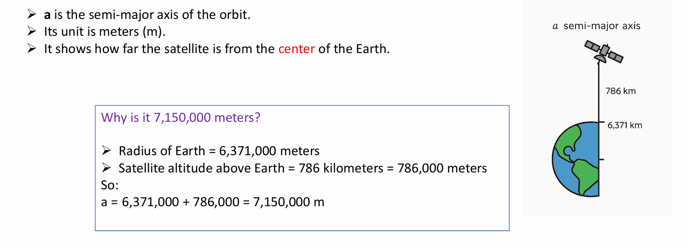
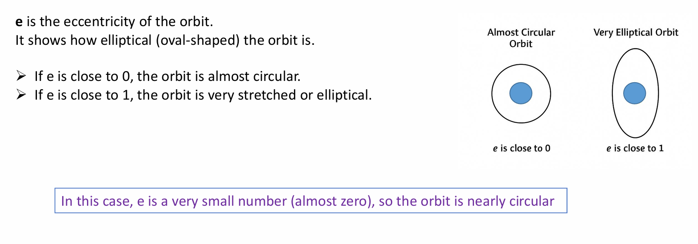
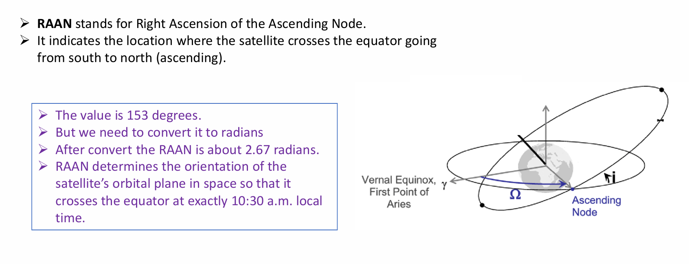
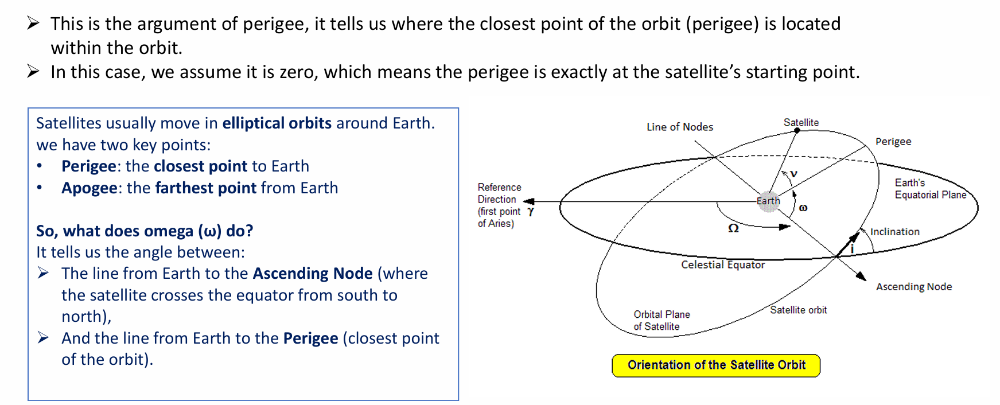
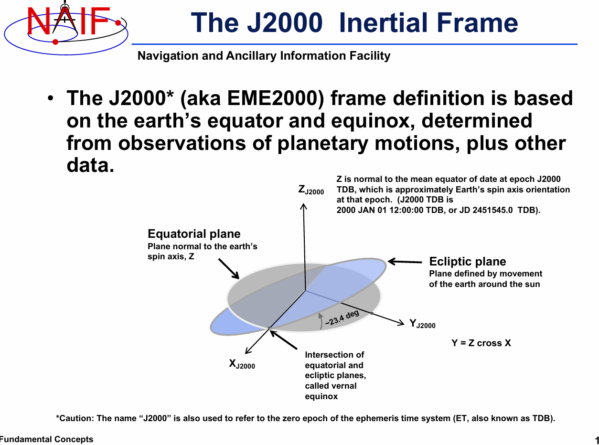
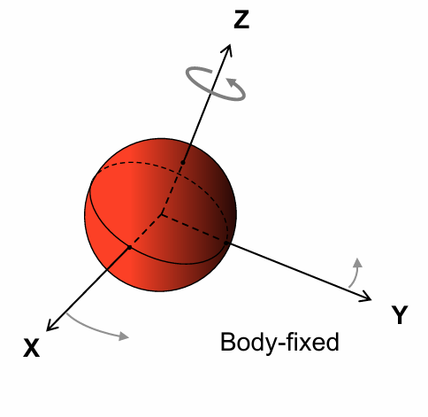
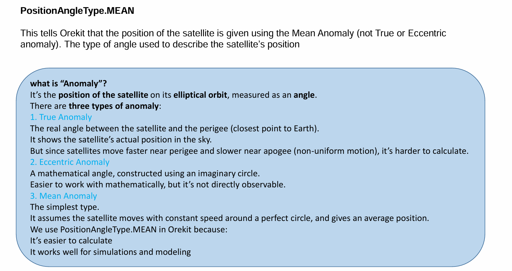
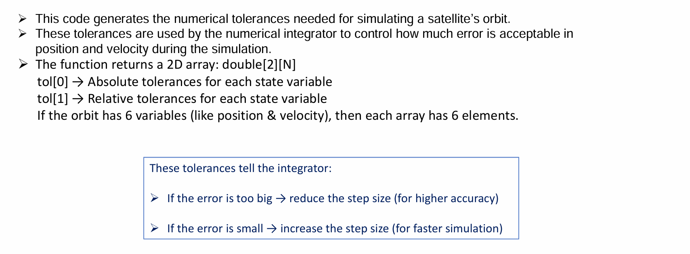
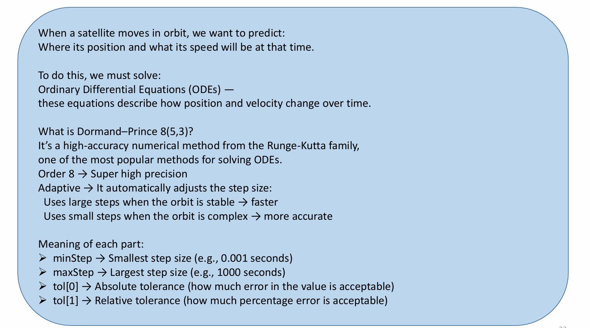
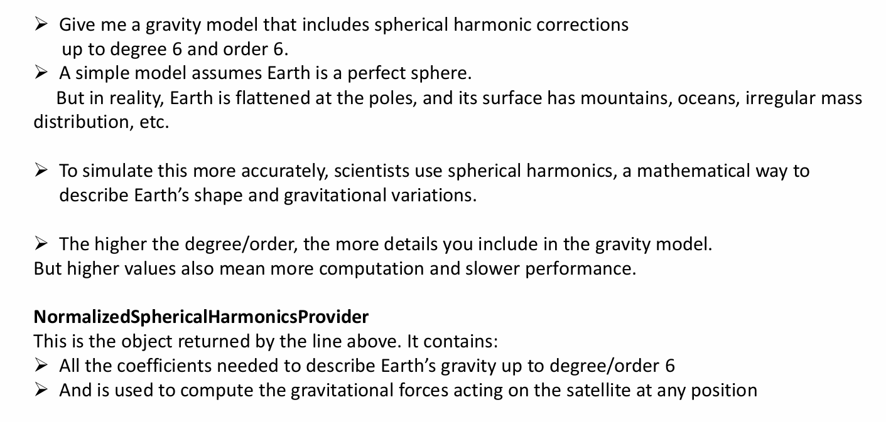

# simulate the orbit of the Sentinel-2A satellite


```java
Locale.setDefault(Locale.US);
```
sets the default locale to U.S. for consistent number and date formatting.


```java
File orekitData = new File("C:\Users\Adm Local\Desktop\AICOX\Foundational Study\OrekitOrbitSim\orekit-data-main");
DirectoryCrawler crawler = new DirectoryCrawler(orekitData);
DataContext.getDefault().getDataProvidersManager().addProvider(crawler);
```
This code loads the Orekit data needed for simulations:
 * File orekitData = new File(...) creates a File object pointing to the directory containing Orekit data files.
 * DirectoryCrawler crawler = new DirectoryCrawler(orekitData) creates a crawler that can read all valid data 
files inside that directory.
 * DataContext.getDefault().getDataProvidersManager().addProvider(crawler) registers the crawler so that
 Orekit can access the data (e.g., Earth orientation, gravity models, time scales) during orbit computations.

 
 Required libraries:
  
```java
import java.io.File;   //Represents a file or directory path 
import org.orekit.data.DirectoryCrawler; //to load Orekit data.
import org.orekit.data.DataContext; //Manages the Orekit data providers, allowing access to the required data.
 ```

These values represent the Keplerian elements of the satellite’s orbit.
```jav
double a = 7150000.0;
```

```jav
double e = 0.0001;
```


```jav
double i = Math.toRadians(98.62);
```


```jav
double raan = Math.toRadians(153.0);
```



```jav
double omega = Math.toRadians(0.0);
```


```jav
double M0 = Math.toRadians(0.0);
```


```jav
AbsoluteDate startDate = new AbsoluteDate(2025, 3, 18, 0, 0, 0.0, TimeScalesFactory.getUTC());
```

This line defines the start date and time of the simulation:
March 18, 2025 at 00:00:00 (UTC time) using Orekit’s AbsoluteDate class.
and Use UTC time scale which is standard for space simulations.

 Required libraries:
  
```java
import org.orekit.time.AbsoluteDate;   //Represents a specific date and time
import org.orekit.time.TimeScalesFactory;  //Provides different time scales, such as UTC
 ```


```jav
Frame inertialFrame = FramesFactory.getEME2000();
```
To simulate an orbit, we need to understand how the satellite moves in space.
For this, we use a space-based reference frame called EME2000,
which is fixed in space, as if we’re observing the satellite from the perspective of the stars.




 Required libraries:
  
```java
import org.orekit.frames.FramesFactory; //Provides predefined reference frames (e.g, EME2000).
import org.orekit.frames.Frame; //Represents a reference frame to measure satellite position and velocity.
 ```


```jav
Frame earthFrame = FramesFactory.getITRF(IERSConventions.IERS_2010, true);
```

This line creates an Earth-fixed frame using the ITRF model with IERS 2010 standards.
It rotates with the Earth and is used to compute positions relative to locations on Earth’s surface.



 Required libraries:
  
```java
import org.orekit.frames.FramesFactory; // Provides methods to create standard frames of reference (e.g., EME2000, ITRF)
import org.orekit.frames.Frame; // Represents a reference frame (e.g., Earth-centered or inertial frame)
import org.orekit.utils.IERSConventions; // Defines the IERS (International Earth Rotation and Reference Systems) 
```


```java
Orbit initialOrbit = new KeplerianOrbit(a, e, i, omega, raan, M0,
                    PositionAngleType.MEAN, inertialFrame, startDate, Constants.WGS84_EARTH_MU);
```
In this section, the initial orbit is created using the Keplerian elements defined earlier. This orbit is specifically 
designed for the Sentinel-2A satellite. KeplerianOrbit represents a Keplerian orbit in which the satellite’s 
position and velocity are computed based on these elements.
Constants.WGS84_EARTH_MU
This is Earth’s gravitational parameter (μ). Its value is 3.986004418 × 10¹⁴ m³/s².



 Required libraries:
  
```java
import org.orekit.orbits.KeplerianOrbit;  //Used to define an orbit using Keplerian elements
import org.orekit.orbits.Orbit;   //General interface for different types of orbits (Keplerian or others)
import org.orekit.orbits.PositionAngleType;  //Specifies the angle type (Mean, True, or Eccentric)
import org.orekit.utils.Constants;  //Provides predefined constants such as Earth's gravitational parameter (MU)
```


```java
SpacecraftState initialState = new SpacecraftState(initialOrbit, 1200.0);
```

The initial state of the satellite (including position and velocity) is defined using the previously specified orbit 
and the satellite’s mass (1200 kg). The SpacecraftState object is used to track the satellite’s state throughout 
the simulation.

Required libraries:

```java
import org.orekit.propagation.SpacecraftState; // Represents the state of the spacecraft at a given time, including its position, velocity
```


```java
double minStep = 0.001;
double maxStep = 1000.0;
```

During the simulation, compute the satellite’s motion step by step,
 but let each step vary between 1 millisecond and 1000 seconds.
 * When the motion is complex or fast-changing (near Earth),
 Orekit uses a small step like 1 ms for better accuracy.
 * When things are smooth and stable (far from Earth ),
 It switches to larger steps, up to 1000 s, to save computation time.


```java
double[][] tolerances = NumericalPropagator.tolerances(10.0, initialOrbit, OrbitType.KEPLERIAN);
```
Predict the satellite’s motion with a precision where the maximum error at any moment is no more than 10 meters

This value directly affects the overall accuracy of the simulation.

 If you decrease it:

 ✅You get higher precision,
 ❌But the simulation becomes slower and more computationally heavy.

 If you increase it:

 ✅The simulation is faster,
 ❌But you lose accuracy in the satellite’s predicted position.



 Required libraries:
  
```java
import org.orekit.propagation.numerical.NumericalPropagator;
import org.orekit.orbits.OrbitType;
```

```java
DormandPrince853Integrator integrator = new DormandPrince853Integrator(minStep, maxStep, tolerances[0], tolerances[1]);
```

This line creates a Dormand–Prince 8(5,3) integrator,
a high-precision numerical method for solving ordinary differential equations (ODEs).
It adjusts its time step based on error tolerances:




Required libraries:
  
```java
import org.hipparchus.ode.nonstiff.DormandPrince853Integrator;
```

```java
NumericalPropagator propagator = new NumericalPropagator(integrator);
```

This line creates a NumericalPropagator object named propagator,
which uses the previously defined integrator to compute the satellite’s motion over time.
It numerically integrates the equations of motion based on the satellite's orbit and acting forces.

Required libraries:
  
```java
import org.orekit.propagation.numerical.NumericalPropagator;
```
```java
propagator.setOrbitType(OrbitType.CARTESIAN);
```

Keplerian orbit describes the satellite’s motion using six orbital elements.
Cartesian orbit gives the satellite’s real-time position and velocity in 3D space.
We use Keplerian to define the orbit, and Cartesian to simulate it accurately.

Required libraries:
  
```java
import org.orekit.orbits.OrbitType;
```

```java
propagator.setInitialState(initialState);
```

This line sets the initial state of the satellite in the propagator.
The initialState includes the satellite’s orbit and mass,
and tells the propagator where and how the simulation should begin.

```java
NormalizedSphericalHarmonicsProvider gravityProvider = GravityFieldFactory.getNormalizedProvider(6, 6);
```


Required libraries:
  
```java
import org.orekit.forces.gravity.potential.NormalizedSphericalHarmonicsProvider;
import org.orekit.forces.gravity.potential.GravityFieldFactory;
```

```java
propagator.addForceModel(new HolmesFeatherstoneAttractionModel(earthFrame, gravityProvider));
```


This line adds the Holmes–Featherstone gravity model to the propagator.
It uses an Earth-fixed frame and a spherical harmonics provider to account for Earth’s non-spherical shape and gravity variations.
This improves the accuracy of the orbit simulation by modeling real-world gravitational effects.

The HolmesFeatherstoneAttractionModel is a highly accurate gravity model
designed for celestial bodies like Earth. It uses normalized spherical harmonics
and a stable recursive algorithm optimized for high-degree gravity fields,
based on the 2002 work by Holmes and Featherstone.
This makes it ideal for precise orbit simulations in modern computing environments.


Required libraries:
  
```java
import org.orekit.forces.gravity.HolmesFeatherstoneAttractionModel;
```
```java
 MarshallSolarActivityFutureEstimation msafe = new MarshallSolarActivityFutureEstimation(
                    MarshallSolarActivityFutureEstimation.DEFAULT_SUPPORTED_NAMES,
                    MarshallSolarActivityFutureEstimation.StrengthLevel.AVERAGE);
```


This line creates a solar activity model using the
MarshallSolarActivityFutureEstimation class with an average activity level.
It is used to estimate the effect of solar radiation on Earth’s atmosphere,
which influences drag on satellites.


Required libraries:
  
```java
import org.orekit.models.earth.atmosphere.data.MarshallSolarActivityFutureEstimation;
```

```java
OneAxisEllipsoid earth = new OneAxisEllipsoid(
                    Constants.WGS84_EARTH_EQUATORIAL_RADIUS,
                    Constants.WGS84_EARTH_FLATTENING,
                    earthFrame);
```


This line defines Earth as a rotating ellipsoid using the WGS84 reference model.
It provides a more realistic representation of Earth’s shape than a simple sphere.
The frame used is Earth-fixed (ITRF), which allows accurate computation of surface-


Required libraries:
  
```java
import org.orekit.bodies.OneAxisEllipsoid;
import org.orekit.utils.Constants;
```

```java
NRLMSISE00 atmosphere = new NRLMSISE00(msafe, CelestialBodyFactory.getSun(), earth);
```

Instead of assuming a constant value for atmospheric density,
this model calculates the real density of the atmosphere at each moment, at each altitude, and depending on solar activity.

This line builds a realistic atmospheric model using NRLMSISE-00,
which considers solar activity (msafe), Earth’s ellipsoidal shape (earth),
and the Sun’s position (getSun()).
It enables accurate computation of atmospheric drag on the satellite.

Required libraries:
  
```java
import org.orekit.models.earth.atmosphere.NRLMSISE00;
import org.orekit.bodies.CelestialBodyFactory;
```

```java
IsotropicDrag dragModel = new IsotropicDrag(4.0, 2.2);
```

IsotropicDrag is a class in Orekit that models atmospheric drag assuming the satellite reacts equally in all directions
 satellite has a 4 m² surface area and a drag coefficient of 2.2.
 IsotropicDrag is a class in Orekit that models atmospheric drag with the assumption that the satellite's shape causes equal drag from any direction.
This is useful when:
* you don’t know the detailed geometry of the spacecraft or you just want a simplified model

Required libraries:
  
```java
import org.orekit.forces.drag.IsotropicDrag;
```

```java
propagator.addForceModel(new DragForce(atmosphere, dragModel));
```

This line tells the propagator to include the atmospheric drag force using:

* the realistic atmospheric model atmosphere (NRLMSISE-00)

* the drag behavior of the satellite, described by dragModel (IsotropicDrag)

So now the propagator will calculate how the air slows down the satellite as it moves through Earth’s upper atmosphere.

Required libraries:
  
```java
import org.orekit.forces.drag.DragForce;
```

```java
RadiationSensitive radiationModel = new IsotropicRadiationSingleCoefficient(4.0, 1.5);
```


Required libraries:
  
```java
import org.orekit.forces.radiation.IsotropicRadiationSingleCoefficient;
import org.orekit.forces.radiation.RadiationSensitive;
```
```java
SolarRadiationPressure srp = new SolarRadiationPressure(CelestialBodyFactory.getSun(), earth, radiationModel);
```

This line creates the solar radiation pressure (SRP) force model using the current Sun position,
Earth’s shape for eclipse computation, and a satellite radiation model.
It enables the propagator to account for the force exerted by sunlight on the satellite.

Required libraries:
  
```java
import org.orekit.forces.radiation.SolarRadiationPressure;
import org.orekit.bodies.CelestialBodyFactory;
```

```java
 propagator.addForceModel(srp);
```
This line adds the solar radiation pressure (SRP) force model to the propagator

```java
propagator.addForceModel(new ThirdBodyAttraction(CelestialBodyFactory.getSun()));
propagator.addForceModel(new ThirdBodyAttraction(CelestialBodyFactory.getMoon()));
```


These lines add the gravitational effects of the Sun and the Moon to the propagator
using the ThirdBodyAttraction force model.
This improves the accuracy of orbit prediction.

Required libraries:
  
```java
import org.orekit.forces.gravity.ThirdBodyAttraction;
import org.orekit.bodies.CelestialBodyFactory;
```

```java
 PrintWriter writer = new PrintWriter(new FileWriter("C:/Users/Adm Local/Desktop/OrekitOrbitSim/orbit_output.csv"));
            writer.println("Date,Altitude(m),SpecificEnergy(J/kg),Speed(m/s),a(m),e,i(deg),RAAN(deg),Latitude(deg),Longitude(deg)");
```


These lines create a CSV file and write the header row.
This file will store the satellite’s orbital parameters and physical properties during propagation,
allowing for later analysis or plotting.

Required libraries:
  
```java
import java.io.FileWriter;
import java.io.PrintWriter;
```

```java
propagator.setStepHandler(60.0, currentState -> {
```   
This sets a step handler for the propagator.
It means:

"Every 60 seconds of simulation time, run this block of code."

The variable currentState represents the current state of the satellite at that specific time step

```java
AbsoluteDate date = currentState.getDate();
```  

This line retrieves the simulation time for this step.
Example: 2025-03-18T00:04:00.000Z

Time is needed because Earth's position and orientation change over time — so calculations must be time-aware.

```java
PVCoordinates pv = currentState.getPVCoordinates(earthFrame);
``` 

This gets the Position and Velocity (PV) of the satellite in the Earth-fixed frame (ITRF).

P = Position (x, y, z)

V = Velocity (vx, vy, vz)

We use the Earth-fixed frame so we can later compute altitude relative to Earth's surface.

Required libraries:
  
```java
import org.orekit.utils.PVCoordinates;
``` 


```java
Vector3D position = pv.getPosition();
``` 

This simply extracts the position vector (x, y, z) from the PV coordinates

```java
import org.hipparchus.geometry.euclidean.threed.Vector3D;
``` 


```java
earth.transform(position, earth.getBodyFrame(), date)
``` 

It transforms the satellite’s position from 3D Cartesian coordinates into geodetic coordinates (latitude, longitude, altitude), using:

the Earth ellipsoid model (WGS84)

the current date

and the body frame (rotating Earth frame)

This transformation accounts for:

Earth's rotation
Earth's ellipsoidal shape

```java
.getAltitude();
``` 

This retrieves the altitude part of the geodetic position 
how high the satellite is above Earth's surface, in meters.

```java
System.out.println(date + "  Altitude: " + String.format(Locale.US, "%.2f", altitude) + " m");
```

This line prints the simulation time and satellite altitude to the console.
The altitude is formatted with two decimal places using Locale.US to ensure consistent decimal formatting.
```java
Vector3D velocity = pv.getVelocity();
```
This line retrieves the 3D velocity vector of the satellite
from the PVCoordinates object (which contains both position and velocity).

```java
double speed = velocity.getNorm();
```
 This calculates the magnitude (norm) of the velocity vector —
the speed of the satellite (in meters per second, without direction).

```java
double r = position.getNorm();
```
 This gets the magnitude of the position vector,
which is the satellite’s distance from Earth’s center, in meters.

```java
double mu = Constants.WGS84_EARTH_MU;
```
μ (mu) is the standard gravitational parameter for Earth.

```java
 double specificEnergy = 0.5 * speed * speed - mu / r;
```
 This calculates the specific mechanical energy of the satellite.

```java
Orbit currentOrbit = currentState.getOrbit();
```

 This gets the current orbital state of the satellite
as an Orbit object — which may be Keplerian or Cartesian.

```java
double a_now = currentOrbit.getA();
```
The semi-major axis of the current orbit (in meters).
For example, in LEO: a ≈ 7,150,000 m

```java
double e_now = currentOrbit.getE();
```

The eccentricity of the orbit


The inclination of the orbit in degrees.
Since getI() returns the angle in radians, we use Math.toDegrees() to convert it.

```java
double i_now = Math.toDegrees(currentOrbit.getI());
```
The inclination of the orbit in degrees.
Since getI() returns the angle in radians, we use Math.toDegrees() to convert it.

```java
 double raan_now = Math.toDegrees(new KeplerianOrbit(currentOrbit).getRightAscensionOfAscendingNode());

 ```
  The Right Ascension of the Ascending Node (RAAN) — the angle where the satellite crosses the equator heading north.

First, we convert the current orbit to a KeplerianOrbit
(RAAN is only available in Keplerian representation)

Then we extract RAAN
And convert it to degrees

```java
 writer.printf(Locale.US, "%s,%.2f,%.4f,%.4f,%.2f,%.5f,%.4f,%.4f",
                        date, altitude, specificEnergy, speed, a_now, e_now, i_now, raan_now);
                        
 ```


This line writes the satellite's orbital and physical parameters to a CSV file using printf formatting.
It ensures consistent decimal formatting by using Locale.US, and outputs the data with specific precision for scientific clarity.

```java
AbsoluteDate finalDate = startDate.shiftedBy(365 * 86400.0);
propagator.propagate(finalDate);                 
 ```

This code sets the final propagation date to one year after the start date
by shifting it by 365 × 86400 seconds.
Then, it calls the propagate() method to simulate the satellite’s orbit from start to end.

```java
 writer.close();
            System.out.println("Propagation finished and data saved to orbit_output.csv");
                } catch (Exception e) {
            e.printStackTrace();
        }
    }
}
```

These lines close the output file and display a success message.
If any error occurs during the simulation or file writing, it will be caught and printed to the console using e.printStackTrace().